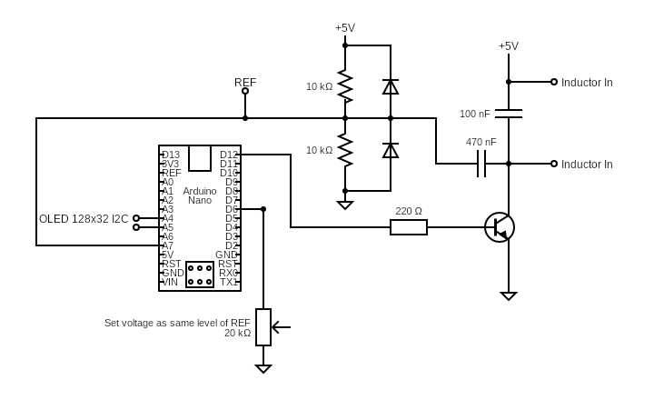

# Inductometer

A digital inductance meter based on Arduino that allows measuring inductors in the range from mH to nH. The device uses a resonance measurement method and displays the results on an OLED screen.

## Features

- Inductance measurement from nH to mH
- 128x32 I2C OLED display for result visualization
- Serial communication for debugging
- Measurement validation system
- Built-in calibration
- Error and open circuit indication

## Required Hardware

- Arduino Nano or compatible (ATmega328P)
- 128x32 I2C OLED Display (SSD1306)
- Components according to schematic:
  - Resistors: 2x 10kΩ, 1x 220Ω, 1x 20kΩ (potentiometer)
  - Capacitors: 100nF, 470nF
  - TIP 31C or similar NPN Transistor
  - 2x Diodes 1N4148 or similar
  - Connectors for the inductor to be measured

  

## Connections

### OLED Display
- SDA -> A4
- SCL -> A5
- VCC -> 5V
- GND -> GND

### Measurement Circuit
- Inductor to be measured connects between the two points marked as "Inductor In"
- The 20kΩ potentiometer is used to adjust the reference level
- The measurement signal is taken from AIN0 pin

## Compilation and Installation

Requires the following tools:
- avr-gcc
- avrdude
- make

To compile:
```bash
make
```

To upload to Arduino:
```bash
make u
```

To clean generated files:
```bash
make clean
```

## Operation

1. Connect the inductor to be measured
2. The device will display:
   - Inductance value with units (nH, µH, mH)
   - "Open" if no inductor is connected
   - "Error" if the measurement is invalid

3. Results are also sent through serial port (57600 baud) for debugging

## Technical Details

### Measurement Method
The device uses a resonance measurement method where:
- A pulse is generated through pin D12
- The oscillation period is measured using Timer1 and the analog comparator
- Inductance is calculated using the formula L = T²/C where:
  - L is the inductance
  - T is the measured period
  - C is a calibration constant

### Measurement Validation
Measurements are validated by checking:
- That the measured period is within reasonable limits
- That oscillations are stable
- That there are no negative or erroneous values

### Calibration
The calibration factor (CALIBRATION) is defined as 1.11 in the code. This value may need adjustment according to the exact characteristics of the built circuit.

## References

The project uses the following libraries:
- [L Meter](https://github.com/5VLogic/l_meter)
- [SSD1306 OLED Driver](https://github.com/Matiasus/SSD1306)
- [Serial ATmega Library](https://github.com/ramizpolic/serial-atmega)

## Known Limitations

- Accuracy depends on the quality of components used
- Measurements can be affected by parasitic capacitances
- Measurement range is limited by the maximum time the timer can measure

## License

This project is based on components with different licenses. Please refer to individual files and referenced repositories for more details about specific licenses.
